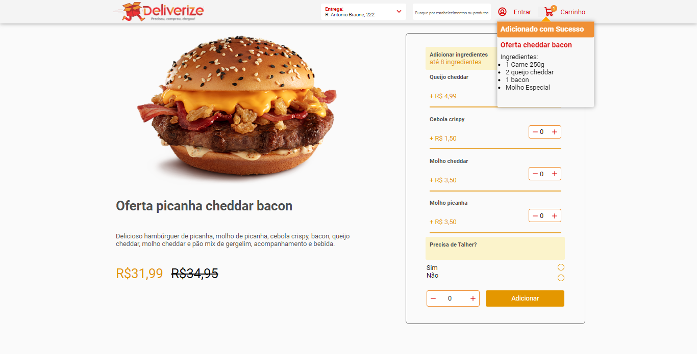

## TeamSoft Desafio

Essa aplicação é um teste técnico da teamsoft.

Fiz o projeto usando react, vite e typescript, na parte de estilização usei o styled-components, também usei uma lib chamada <a href="https://www.radix-ui.com/">RadixUI</a> para criação do popover.
Fiz o deploy da aplicação na vercel, pode conferir no <a href="https://teamsoft-desafio-two.vercel.app/">link</a>

A estrutura de pastas está bem dividida, em "components" fica os componentes que criei que se repetem na página, em "Layouts" ficam a "Description" onde criei a descrição do produto com o preço, em "SelectedMenu" criei o menu de escolha de ingredientes que também está interativo. O popover usei a lib radix que me trás um componente sem estilização onde posso montar além da ascessibilidade. Em "styles/theme/default.ts" setei algumas configuraões de cores para poder usar no styled-componentes e também tamanhos de fontes.

### Techs:
- Typescript
- React
- Vite
- Styled-componets
- Phosphor-react

### Desafios:
- [x] React
- [x] Responsividade
- [] Consumir endpoint

### Layout

